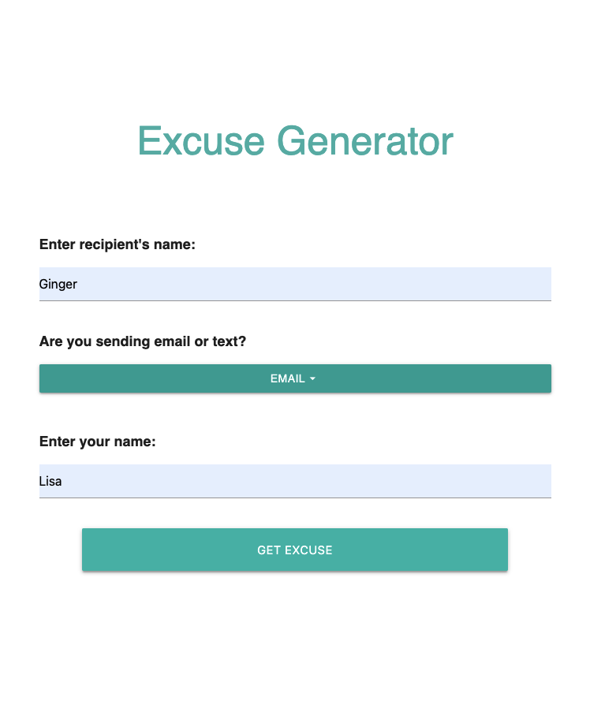
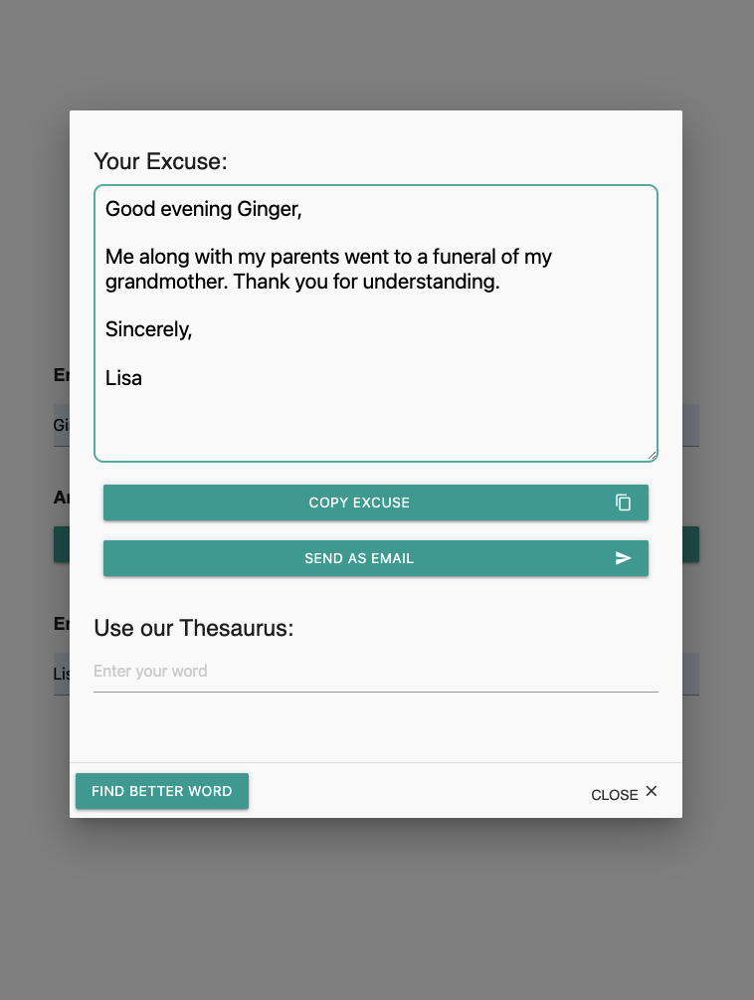

# excuse-generator
The goal of this app was to generate random exucses that was able to be preformatted for you in a email format or a SMS format. You are also capable of looking up synonyms to a word you want to change in the text. 

Deployed Application Link: 
https://velkyam.github.io/excuse-generator/#team-8

## User Story 
AS someone who has a busy schedule or antisocial moods 
I WANT to have an app that creates random excuses and preformats a message for me. 

GIVEN a excuser generator app, 
WHEN I open the app, THEN I may input the recipients name.  
WHEN I select Email as my format THEN I may input my name. 
WHEN I choose SMS THEN I go straight to the "Get Excuse" button. 
WHEN I do not make any selection THEN random excuse in a fromat of email will be generated. 
WHEN I do not input recipient's name or my name THEN random excuse with recipient and name placeholders will be generated. 
WHEN I select email THEN Email greeting such as (Good morning, Good afternoon, Good evening, Hello) will be generated according to the current time. 
WHEN I have finished putting my inputs and choosing email then I can click "Get Excuse" button.  
WHEN I click "Get Excuse" button THEN a modal opens with my excuse THEN I can click the copy button or the Send Email button to have my preformatted email open in my default mail client.  
WHEN I enter word in the Thesaurus THEN I find synonms to the word.  

## Usage

    

## Credits 
https://github.com/velkyam 
https://github.com/bdibil 
https://github.com/lzvalentin 
https://github.com/Gamunale 

Deployed Application:

https://velkyam.github.io/excuse-generator/

To edit this project:

1. Create a new repository on your GitHub account and clone it to your computer.

2. Copy this project to your local repository.

3. Make changes.

4. When you're ready to deploy, use the git add, git commit, git pull and git push commands to save and push your code to your GitHub repository.

MIT License

Copyright (c) [2021] [Team8]

Permission is hereby granted, free of charge, to any person obtaining a copy of this software and associated documentation files (the "Software"), to deal in the Software without restriction, including without limitation the rights to use, copy, modify, merge, publish, distribute, sublicense, and/or sell copies of the Software, and to permit persons to whom the Software is furnished to do so, subject to the following conditions:

The above copyright notice and this permission notice shall be included in all copies or substantial portions of the Software.

THE SOFTWARE IS PROVIDED "AS IS", WITHOUT WARRANTY OF ANY KIND, EXPRESS OR IMPLIED, INCLUDING BUT NOT LIMITED TO THE WARRANTIES OF MERCHANTABILITY, FITNESS FOR A PARTICULAR PURPOSE AND NONINFRINGEMENT. IN NO EVENT SHALL THE AUTHORS OR COPYRIGHT HOLDERS BE LIABLE FOR ANY CLAIM, DAMAGES OR OTHER LIABILITY, WHETHER IN AN ACTION OF CONTRACT, TORT OR OTHERWISE, ARISING FROM, OUT OF OR IN CONNECTION WITH THE SOFTWARE OR THE USE OR OTHER DEALINGS IN THE SOFTWARE.
