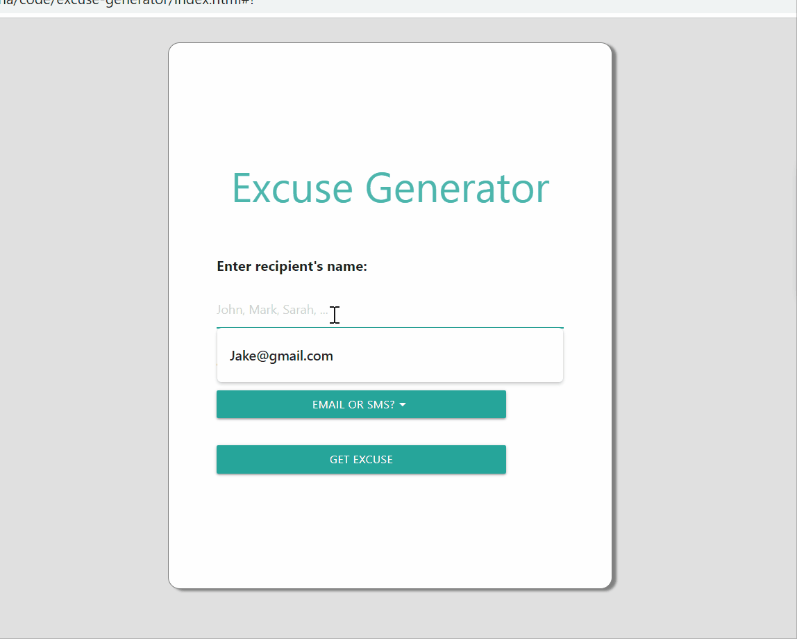

# excuse-generator

## User Story 
AS someone who has a busy schedule 
I WANT to have an app that creates random excuses and preformats a message for me.

GIVEN a excuser generator app,
WHEN I open the app, THEN I input the reciepents name. 
WHEN I choose Email THEN I input my name.
When I choose SMS THEN I go straight to the "Get Excuse" button.
WHenhave finished putting my inputs and choosing email then I can click "Get Excuse" button. 
When I click that button THEN a new window opens with my excuse THEN I can click the copy button or the Send Email button to have my preformatted email open my default browser. 
When the new window pops up THEN I can scroll down to find synonms to words I want to change from the exucse or preformatted text. 

## Usage

 ```md
    
    ```
## Credits 
https://github.com/velkyam
https://github.com/bdibil
https://github.com/lzvalentin
https://github.com/Gamunale